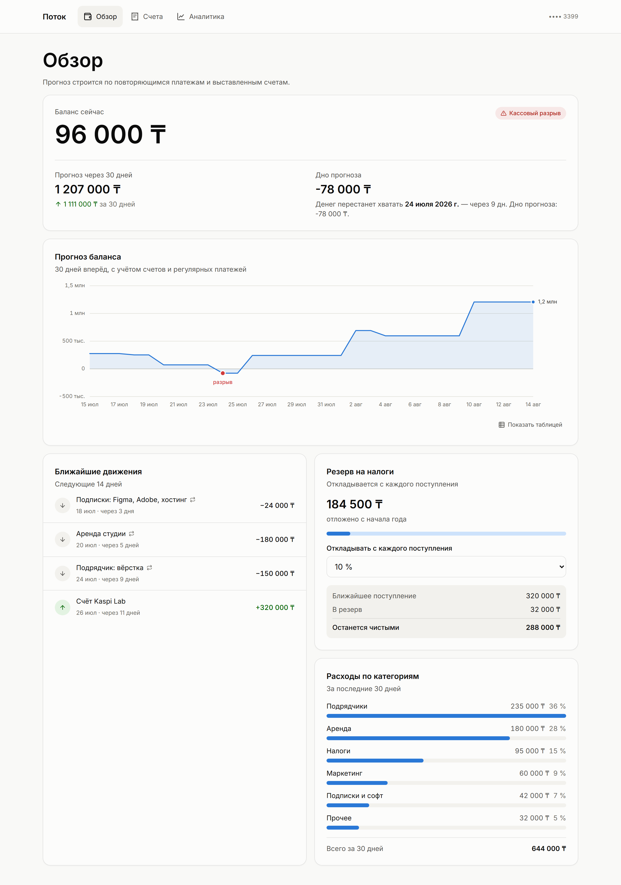
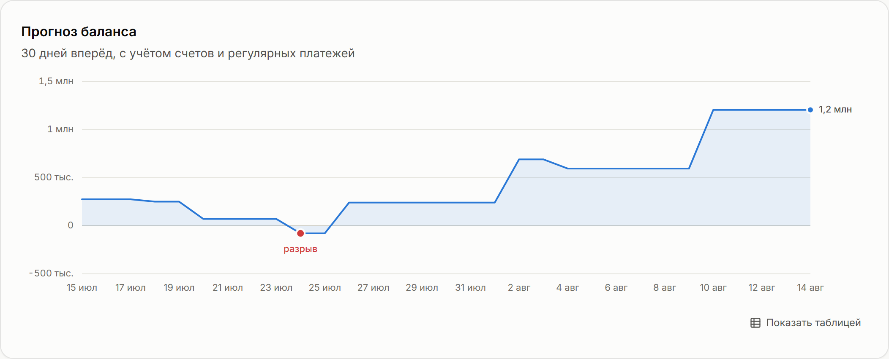
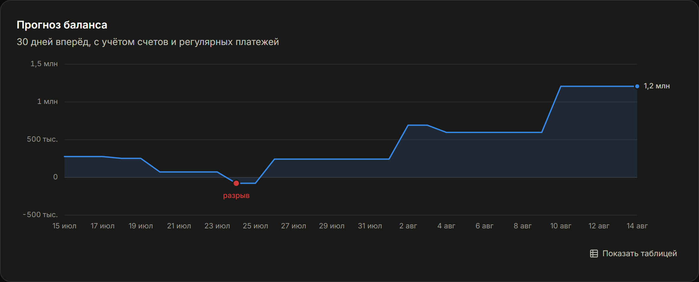
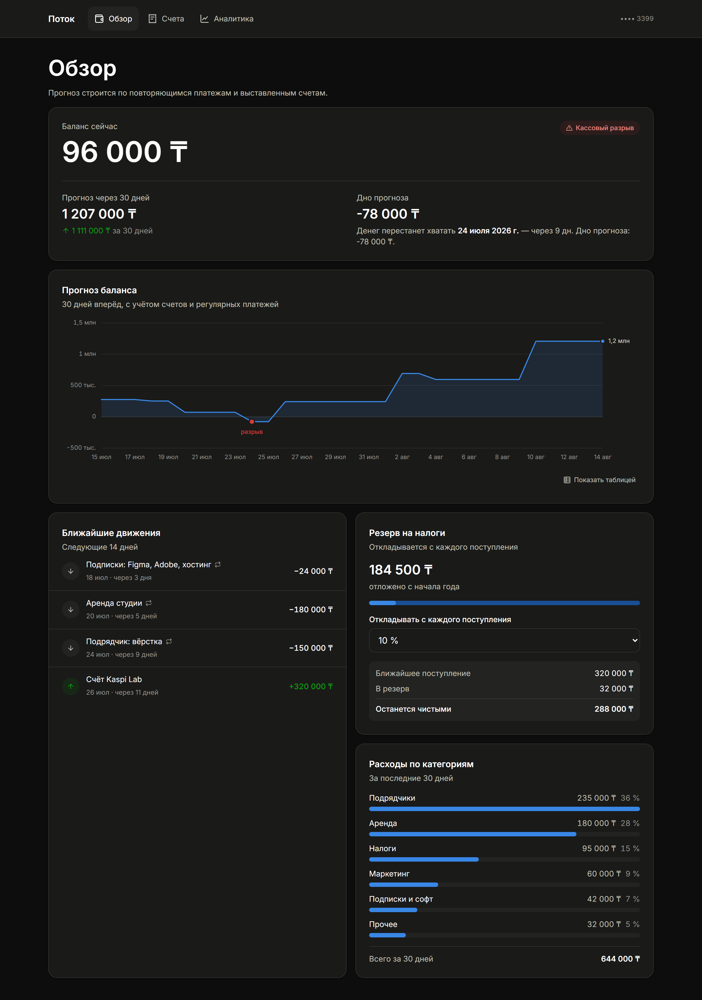
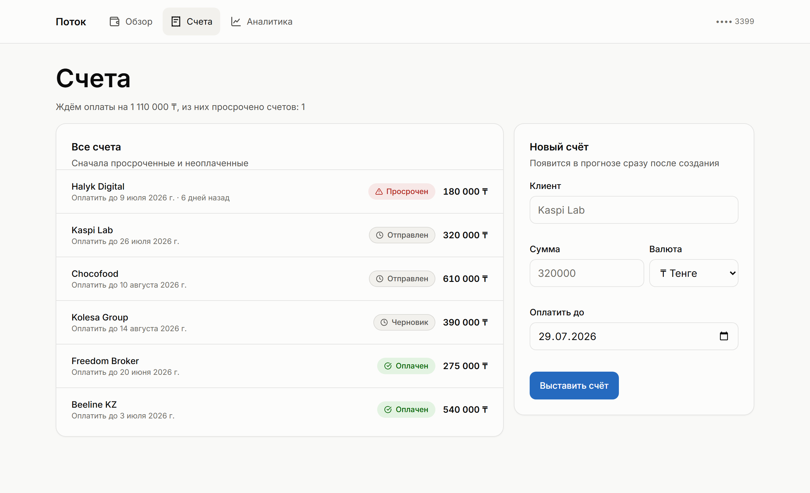
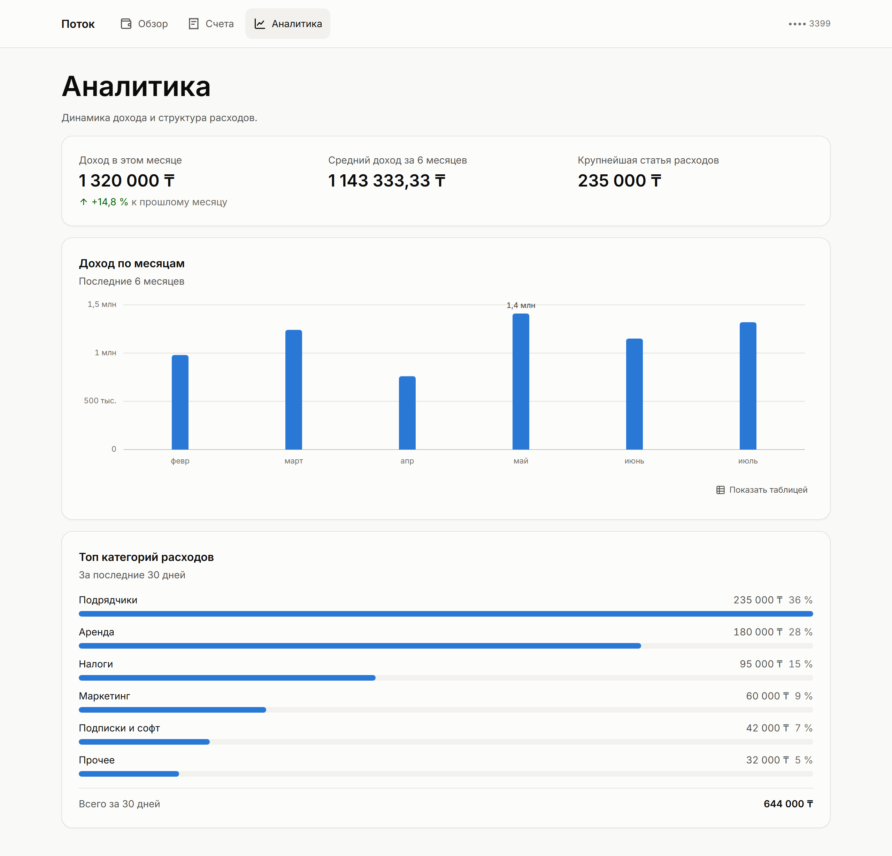
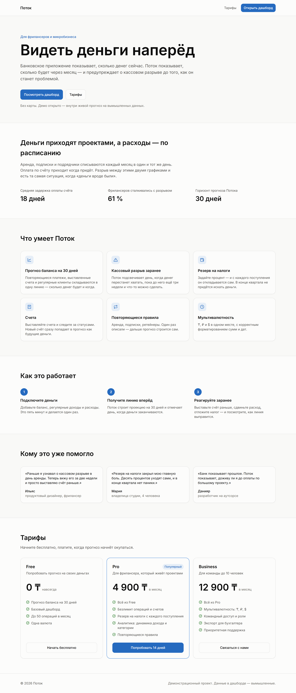
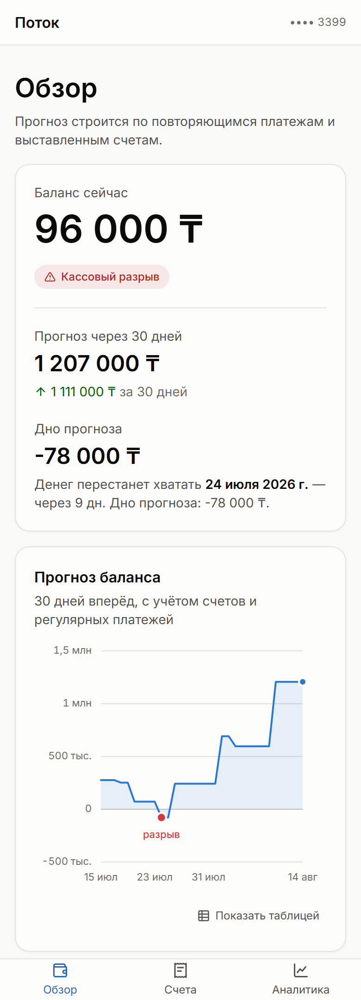

# Поток

**Видеть деньги наперёд.**

Банковское приложение показывает, сколько денег сейчас. Поток показывает, **сколько будет через месяц**: строит прогноз баланса на 30 дней вперёд по повторяющимся платежам и выставленным счетам, заранее подсвечивает кассовый разрыв, откладывает резерв на налоги и ведёт инвойсы.

Для фрилансеров и микробизнеса — тех, у кого деньги приходят проектами, а расходы списываются по расписанию.



> На скриншоте — та самая ситуация, ради которой продукт существует. На счету 96 000 ₸, обычное банковское приложение скажет «всё хорошо». Поток говорит: 24 июля денег не хватит — за два дня до того, как придёт оплата по счёту.

---

## Запуск

```bash
npm install
npm run dev
```

Открыть [localhost:3000](http://localhost:3000) — лендинг, [/overview](http://localhost:3000/overview) — дашборд. Авторизации нет, данные вымышленные: это витрина.

| Скрипт | Что делает |
|---|---|
| `npm run dev` | дев-сервер |
| `npm run build` / `npm start` | продакшен-сборка и запуск |
| `npm test` | 57 тестов (Vitest + Testing Library) |
| `npm run typecheck` | `tsc --noEmit` в strict-режиме |
| `npm run lint` | ESLint |
| `npm run analyze` | сборка с анализом бандла |

---

## Скриншоты

### Прогноз баланса

Главный экран продукта. Метрики рендерятся на сервере и видны сразу — цифры не ждут загрузки графика, а сам график приезжает отдельным чанком.

| Светлая тема | Тёмная тема |
|---|---|
|  |  |

Одна серия — значит, легенды нет: заголовок карточки уже сказал, что нарисовано. Подписано только значение конца ряда, остальное достаётся осью, перекрестьем и таблицей-двойником. Точка разрыва помечена и цветом, и словом.

### Дашборд в тёмной теме

Тёмная тема — не инверсия светлой, а подобранные под тёмную поверхность шаги тех же цветовых шкал.



### Счета

Список со статусами и создание счёта. Новый счёт сразу попадает в прогноз как будущие деньги — проекция ревалидируется вместе со списком.



### Аналитика

Динамика дохода по месяцам и структура расходов. Колонки одного цвета: высота уже кодирует величину, красить её ещё и оттенком нечем.



### Лендинг

Статическая генерация, ноль клиентских компонентов.



### Мобильный

Финтехом пользуются с телефона, поэтому мобильная раскладка здесь основная, а не ужатая десктопная: навигация внизу под большим пальцем, тач-таргеты 44px, подписи оси прореживаются по реальной ширине.



---

## Стек

- **Next.js 15 (App Router)** — маркетинг статикой, продукт на серверных компонентах.
- **React 19 + Server Components** — данные тянутся на сервере, на клиент уезжают только «острова» интерактива.
- **TypeScript strict** (+ `noUncheckedIndexedAccess`) — деньги не прощают ошибок в типах.
- **Tailwind 4 + дизайн-токены** — цвета, радиусы и типографика в CSS-переменных.
- **TanStack Query** — серверное состояние, фоновая ревалидация, оптимистичные обновления.
- **React Hook Form + Zod** — валидация форм; та же схема проверяет тело запроса на сервере.
- **Vitest + Testing Library** — 57 тестов.

Графики написаны на голом SVG без библиотек визуализации: нужны три формы, а любой чарт-пакет весит больше, чем весь остальной клиентский код.

---

## Архитектура

```
Пользователь
    │ HTTPS
    ▼
Next.js
    ├── (marketing)  SSG + ISR — лендинг, тарифы
    ├── (dashboard)  RSC + острова интерактива
    └── api/         Route Handlers — BFF-прокси
                          │
                          ▼
                  Backend API (вне зоны фронта)
```

Фронт не владеет схемой БД — он работает с типизированными ответами API.

**Реального бэкенда в этом репозитории нет.** Его заменяет `src/server/` — прогнозный движок и хранилище в памяти процесса. Контракт на выходе тот же, что у настоящего API, поэтому замена затрагивает `src/server/` и роут-хендлеры, но не UI.

```
src/
  app/
    (marketing)/       лендинг и тарифы — SSG + ISR
    (dashboard)/       overview · invoices · analytics
    api/               Route Handlers
  components/
    ui/                примитивы: Button, Card, Field, Badge, Skeleton
    features/          доменные блоки: ForecastChart, InvoiceForm, TaxReserve
  lib/
    api/               типы (Zod), клиент, серверный доступ, запросы TanStack Query
    chart/             шкалы и подбор делений оси
    format/            деньги, даты, i18n
  server/              заглушка бэкенда: прогнозный движок + хранилище
  styles/tokens.css    дизайн-токены
```

### Серверные компоненты не ходят в собственный API

RSC читает данные напрямую через `lib/api/server.ts` — HTTP-запрос из процесса в самого себя был бы лишним сетевым кругом. Хендлеры в `/api` существуют для клиентских островов и внешних потребителей.

Клиентский API-клиент прогоняет каждый ответ через Zod: «типизированный клиент», который просто кастует `as T`, врёт — он обещает тип, но не проверяет его. Для интерфейса, где на экране деньги, разница между «обещал» и «проверил» принципиальная.

---

## Решения, которые стоит объяснить

### Деньги — целые, всегда

Все суммы живут в **минимальных единицах** (тиын/копейки/центы) целыми числами. Дробных денег в рантайме не существует: `19.99 * 100` в двоичной арифметике даёт `1998.9999999999998`, и один такой расчёт по цепочке превращается в расхождение баланса. Форматирование в человеческий вид происходит только в момент показа.

Тенге печатается через `currencyDisplay: "narrowSymbol"`: CLDR отдаёт знак `₸` только казахской локали, а в `ru-RU` по умолчанию выводит «KZT». Для сервиса про тенге это уже другой продукт.

### Прогнозный движок

`src/server/forecast-engine.ts` считает проекцию по календарным дням: стартовый баланс, затем на каждый день накатываются повторяющиеся правила и ожидаемые оплаты по счетам. Решения, которые видно в тестах:

- **Просроченный счёт ожидается сегодня**, а не в прошедшую дату оплаты — иначе поступление рисуется в прошлом и завышает дно прогноза.
- **Черновики и оплаченные счета — не деньги**: первые ещё не выставлены, вторые уже в балансе.
- **Правило с датой в прошлом догоняется до сегодня**, а не списывается задним числом.
- **`addMonths` не перепрыгивает месяц**: 31 января + 1 месяц = 28 февраля. Наивная реализация дала бы 3 марта, и подписка списалась бы не в свой месяц.
- Даты — ISO-строки и арифметика в UTC: сдвиг часового пояса легко превращает «сегодня» в «вчера», а вместе с этим платёж уезжает не в тот день.

### Цвет — посчитан, а не подобран

Палитра графиков прогнана через валидатор (полоса светлоты, порог насыщенности, разделимость при дальтонизме, контраст к поверхности) отдельно для каждой темы.

**Краска данных и краска интерфейса разделены намеренно.** `--series-1` — одобренный валидатором шаг — живёт только в метках графиков; кнопки и акценты используют `--accent-*`. Причина арифметическая: белый текст на `--series-1` даёт 4.42:1 при пороге 4.5:1.

Статус никогда не передаётся одним цветом: рядом всегда иконка и слово. Надписи носят текстовые шаги (`--status-*-text`), проверенные и на поверхности, и на своих подложках — красный шаг метки на тёмной теме даёт 3.62:1 и как текст не проходит.

### Мелочи, которые нашлись только при проверке глазами

На оси прогноза **срезался минус**: в DOM текст был `-500 тыс.`, но левый край уходил за границу SVG, и обрезался ровно первый символ. На графике баланса это худший из возможных багов — минус единственное, что отличает полмиллиона в плюсе от полумиллиона в минусе. Левое поле теперь рассчитано на самую широкую подпись, а она отрицательная.

Подписи оси **прореживаются по реальной ширине в пикселях**, а не фиксированным шагом «каждые 7 дней»: на телефоне такой шаг разваливается. Все подписи центрированы по своей точке — прижимать крайнюю якорем `start` соблазнительно ради ровного края, но тогда она растёт вправо на всю ширину и наезжает на соседнюю.

---

## Проверено

| Проверка | Результат |
|---|---|
| `npm test` | 57 тестов |
| `npx tsc --noEmit` | чисто, strict |
| `npx eslint .` | чисто |
| `npm run build` | маркетинг `○` статикой, дашборд `ƒ` динамикой, графики в отдельных чанках |
| **axe (WCAG 2.1 AA)** | **0 критичных и серьёзных нарушений** — 5 страниц × 2 темы × 2 ширины |
| Оси графиков | подписи не обрезаются и не наезжают на 6 ширинах (320–1280px) |
| Сквозной сценарий | создание счёта обновляет список и увеличивает прогноз ровно на сумму счёта |

---

## Что дальше

- Сценарии «что если»: добавить клиента или убрать расход и увидеть новую проекцию.
- Напоминания по неоплаченным счетам, экспорт для бухгалтера.
- Реальные аккаунты и сессии — сейчас дашборд открыт без авторизации.
- Storybook для примитивов и Lighthouse CI в пайплайне.

---

Реализация фронтенд-части по спецификации [`Поток.md`](./Поток.md). Данные в дашборде вымышленные.
